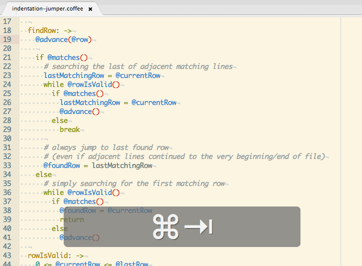

# Indentation Jumper package

A simple package designed to ease the code navigation in Atom.

### Hotkeys

`⌥↓` - jump to next line with same indentation as the current line.

`⌥↑` - jump to previous line with same indentation as the current line.

`⇧⌥↓` - select down to next line with same indentation.

`⇧⌥↑` - select up to previous line with same indentation.

Heavily inspired by corresponding TextMate built-in functionality.
